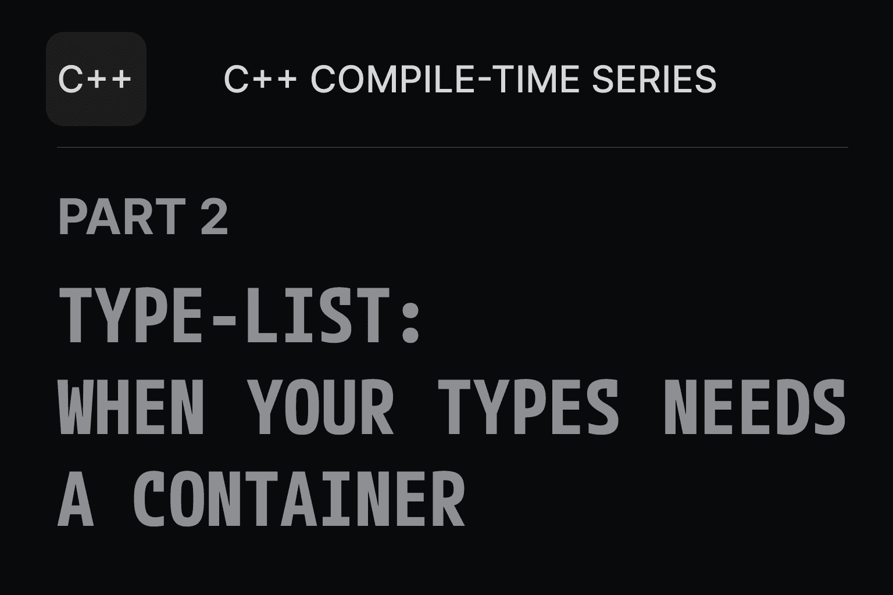

# 👋 Hey there, I'm Jayant!  

I’m a passionate **C++ developer** exploring **game engines, graphics programming, and compile-time metaprogramming**.  
I enjoy solving deep technical challenges, building systems from scratch, and sharing what I learn along the way.  

Mostly, I work on:
- **[Quirk Engine](https://github.com/Jayantkumar56/Quirk)** — a C++ game engine to learn and grow.  
- **[Quirk DevLogs](https://jayantkumar56.github.io/Quirk-Blog/)** — my blog on C++, graphics, and engine deep dives.  
- **[QkTraits](https://github.com/Jayantkumar56/QkTraits)** — a modern C++ header-only library for type traits and utilities.
  
I enjoy exploring graphics systems, diving deep into rendering techniques, and pushing the boundaries of compile-time C++ programming.

---
## ✍️ Latest Blog & DevLogs  

<table>
<tr>
<td width="50%" valign="top" align="center">

<a href="https://jayantkumar56.github.io/Quirk-Blog/Blogs-And-Insights/TypeLists.html">
  
   
  📖 <b>Latest Blog: TypeLists: A Deep Dive into C++ Meta-Programming </b>
</a>

</td>
<td width="50%" valign="top" align="center">

<a href="https://jayantkumar56.github.io/Quirk-Blog/">
  
   
  🌐 <b>Explore more at: Quirk DevLogs</b>
</a>

</td>
</tr>
</table>

---

## 📌 Featured Projects
- [**Quirk**](https://github.com/Jayantkumar56/Quirk) — Game engine project in C++  
- [**QkTraits**](https://github.com/Jayantkumar56/QkTraits) — Modern C++ header-only library for type traits and utilities  
- [**Procedural Terrain**](https://github.com/Jayantkumar56/Procedural-Terrain) — Infinite terrain in Unity  

---

## 🌐 Connect with Me
        

